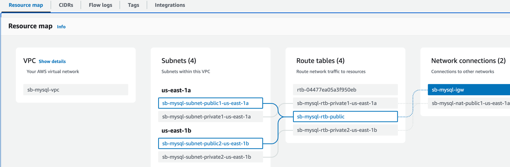
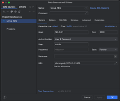
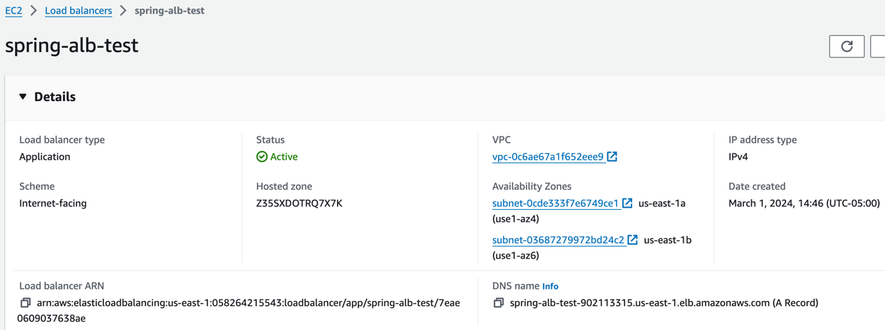

# Deploy Spring Boot application with MySql database in Amazon EKS (Amazon Elastic Kubernetes Service)

In this project, following are high level steps performed:

* Create and setup custom VPC with private and public subnet having NAT gateway and Internet gateway
* Deployed and setup MySql database in private subnet using Amazon RDS service
* Create EKS cluster in private subnet and deploy springboot application
* Deployed Internet facing AWS Application load balancer to access to application
* Connect to MySql database which deployed in private subnet from local machine for development work

Here I have created REST API's to add and retrieve ExchangeRate in the MySql database.

### Dev-ops stacks
* [Docker](https://www.docker.com/)
* [Kubernetes](https://kubernetes.io/)
* [AWS EKS](https://aws.amazon.com/eks/)
* [Helm](https://helm.sh/) - Package manager for Kubernetes

### Tools
* MySql Client: [DBeaver](https://dbeaver.io/)
* [kubectl](https://kubernetes.io/docs/reference/kubectl/)
* [eksctl](https://docs.aws.amazon.com/emr/latest/EMR-on-EKS-DevelopmentGuide/setting-up-eksctl.html)
* IntelliJ IDEA and JDK 17

### Build Tool

Docker file ([Spring boot Docker](https://spring.io/guides/topicals/spring-boot-docker)):
````
FROM openjdk:17-jdk-slim
VOLUME /tmp
COPY target/*.jar app.jar
EXPOSE 8080
CMD ["java", "-jar", "/app.jar"]
````
Command to build Docker image:
```
docker build -t springboot-aws-eks-mysql --platform linux/amd64 .
```
Image generated will be deployed to AWS EKS cluster.

### Perform following steps for application deployment:
1. Setup Custom VPC in AWS account using VPC service including NAT Gateway and Internet Gateway.
    
2. Create a Security Group having inbound rule with access from anywhere. Select VPC created in Step-1 while creating Security group 
    (Note. You can create multiple security groups with restricted access.).
3. Create a MySql database subnet group having a private subnet. (using Amazon RDS service).
4. Create a MySql database and use the subnet group created in Step-3. Also use existing security group created in Step-2
5. Create an EC2 instance key pair and download it on a local machine.
6. Launch EC2 instance.
      - Use EC2 instance key pair created in step-5 while launching EC2 instance.
      - Use the existing security group which was created in Step-2.
7. Once the EC2 instance and MySql databases are in Running/Active state. Connect MySql database from local machine.
      - Open terminal on local machine and cd into ec2 key pair directory.
      - Change permission of ec2 key pair file using command : **chmod 0400 ec2-keypair.pem** (Note: here ec2-keypair.pem is the file which is downloaded when we created ec2-key. Change name accordingly.)
      - Then run the following command:
      ```angular2html
       ssh -i "YOUR_EC2_KEY" -L LOCAL_PORT:RDS_ENDPOINT:REMOTE_PORT EC2_USER@EC2_HOST -N -f
      ```
      Replace YOUR_EC2_KEY with your actual key pair name and other values accordingly.
8. Then open the database client and connect to the database.

      
9. Clone this repository.
10. From the terminal cd into your project directory and build project using command:
    - ``` 
       ./mvnw clean install 
      ```
    - or to build without running tests using ```./mvnw clean install -DskipTests ```
11. Create a docker repository in AWS ECS service. Give it name as springboot-mysql-eks
12. Follow the push commands from AWS ECS repository push command options. (make sure docker is started on the local machine.).

### AWS Application Load Balancer setup steps:
1. Tags all the subnet with the following tags:
    1. For Private subnet:
        - ```key - kubernetes.io/role/internal-elb```
        - ```value - 1 ```
    2. For Public subnet:
        - ```kubernetes.io/role/elb```
        - ```value - 1 ```
    3. For more and updated information [Click here](https://docs.aws.amazon.com/eks/latest/userguide/alb-ingress.html).
2. Create IAM Policy for AWS Load Balancer Controller. For more information [Click here.](https://docs.aws.amazon.com/eks/latest/userguide/aws-load-balancer-controller.html)
    1. Open a new terminal. CD into application repository ```cluster``` directory.
    2. Get policy document using command :
        ``` 
        curl -O https://raw.githubusercontent.com/kubernetes-sigs/aws-load-balancer-controller/v2.5.4/docs/install/iam_policy.json
        ```
3. Apply the policy using command :
     ``` 
            aws iam create-policy \
           --policy-name AWSLoadBalancerControllerIAMPolicy \
           --policy-document file://iam_policy.json 
       
   ```
4. Create cluster using command:
   ```
   eksctl create cluster -f cluster.yaml
   ```      
5. Once the cluster is created, then run following commands:
    1. ``` kubectl apply -k "github.com/aws/eks-charts/stable/aws-load-balancer-controller/crds?ref=master" ```
    
    2. ``` 
        helm repo add eks https://aws.github.io/eks-charts ```
    3. ```
       helm repo update eks
       ```
       
    4. ``` 
       helm upgrade -i aws-load-balancer-controller eks/aws-load-balancer-controller \
          --namespace kube-system \
          --set clusterName=spring-test-cluster \
          --set serviceAccount.create=false \
          --set serviceAccount.name=aws-load-balancer-controller ```
   
    5. ```
       kubectl -n kube-system rollout status deployment aws-load-balancer-controller ```
    6. ```
       kubectl get deployment -n kube-system aws-load-balancer-controller ```
   
6. Once the application load balancer is ready. Open new terminal and cd into project directory.
7. Run the command to deploy application :
   ```
   helm install mychart hmchart 
   ```
7. Check the deployments using ``` kubectl get all```
8. Go into EC2 service in AWS account. Select AWS Load balancer and copy DNS name to test application.
   


###  Following is list of api created in this project:

#### To add ExchangeRate in database :
```
curl --location 'http://localhost:8080/exchange-rate' \
--header 'Content-Type: application/json' \
--data '{
    "source_currency": "USD",
    "target_currency": "INR",
    "rate":80
}'
```

#### To get exchange rate based on SourceCurrency and TargetCurrency :
```
curl --location 'http://localhost:8080/exchange-rate/source_currency/CAD/target_currency/INR'
```
### Make sure to delete all the component in AWS after your practice.
 Run command to delete the cluster ```eksctl delete cluster -f cluster.yaml```
